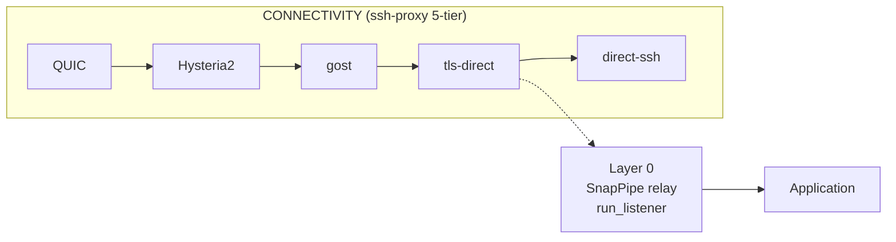

# Operational Deployment

> **Audience**: operators deploying SnapPipe in a multi-host topology
> (laptop ↔ VPS, edge mesh, self-hosted relay cluster). Senior SRE /
> network-architect profile.

SnapPipe is a **transport-layer primitive**, not a finished application.
This document describes where it sits in the operator's stack, the
deployment patterns that work today, and the operational evidence that
the primitives behave as advertised.

## Where SnapPipe sits

SnapPipe provides identity-gated QUIC transport. It does not provide
connectivity (how laptop reaches VPS through a hostile carrier), nor
does it provide application-level sync (moving `~/.claude/` between
hosts). Those concerns are handled by other layers in the operator
stack.

```mermaid
flowchart TB
    APP[Application<br/>operator-side sync + QUIC smoke + bare-metal hardening]
    TRANSPORT[Transport<br/>SnapPipe v0.3.0<br/>identity-gated QUIC + tickets + nonce + rate-limit + TCP tunnel (v0.3.0)]
    CONNECTIVITY[Connectivity<br/>ssh-proxy 5-tier fallback<br/>QUIC + Hysteria2 + gost + tls-direct + direct-ssh]
    NET[Network<br/>laptop ↔ carrier ↔ VPS]

    APP --> TRANSPORT
    TRANSPORT --> CONNECTIVITY
    CONNECTIVITY --> NET
```

**Three layers, distinct concerns:**

| Layer | Responsibility | Operator-facing tool |
|---|---|---|
| **Application** | What data moves (sync plane, relay plane, hardening fragments) | operator-side sync, QUIC smoke harness, config watcher |
| **Transport** (SnapPipe) | Who is allowed to talk (identity gating, replay protection, rate limits) | `snappipe` crate + CLI |
| **Connectivity** | How bytes traverse the carrier (5-tier race-pattern fallback) | `ssh-proxy` daemon + `gost` relay + `tls-direct` bypass |

A failure in one layer does not necessarily fail the others. If the
transport layer rejects a peer (untrusted issuer), the connectivity
layer still completes the TCP+TLS path; the application never sees a
half-open session.

## The laptop ↔ VPS pattern

The canonical deployment that motivated this primitive is the
**laptop ↔ VPS** edge pattern, where:

- The laptop is the operator's working machine behind a residential
  carrier with active DPI inspection and UDP blackholing.
- The VPS is a single Hostinger KVM 8 node (8 vCPU, 32 GB RAM,
  1 Gbps port) running the relay, the sync orchestrator, and the
  Virtuoso triplestore.
- The transport layer must survive carrier-level packet drop, active
  probing, and intermittent UDP blackholes.
- The application layer must move `~/.claude/`, LSP diagnostics, and
  bare-metal hardening fragments between hosts on every turn.

The pattern works because each layer has a defined responsibility:

1. **`ssh-proxy` (connectivity)** races 5 transports; first healthy
   wins. On residential links, Tier 1 (QUIC) and Tier 2 (Hysteria2) are
   skipped because UDP is blackholed. Tier 3 (`gost-client`) is skipped
   because of the lazy-upstream deadlock documented below. **Tier 4
   (`tls-direct`) wins** with a sub-200 ms handshake under live carrier
   DPI. Tier 5 (direct SSH) is the last-resort fallback.
2. **SnapPipe (transport)** accepts the upstream byte stream from
   `ssh-proxy`, demultiplexes per-peer sessions, and gates each session
   on:
   - Issuer NodeId registered in `TrustStore` (empty store = no
     default-allow)
   - `SignedTicket` signature verified against the issuer's
     `VerifyingKey`
   - 16-byte nonce not seen within the 60-second TTL window
   - Per-NodeId rate limit not exceeded
   - ALPN matches the `DEFAULT_ALPN` constant
3. **Application layer** pushes and pulls fragments over the
   gated sessions: `~/.claude/` sync, hardening fragments, LSP
   diagnostics, agent context deltas.

## Operational evidence

The 5-tier race-pattern probe and the `tls-direct` bypass path are
documented in detail in the canonical case study:

- **Gist**: [TLS-Direct Bypass of Lazy Proxy Deadlocks](https://gist.github.com/louzt/3991f144c7d67726045af3cefc60f42a)
  (English)
- **Gist (Spanish)**: [Bypass TLS-Direct de Deadlocks de Proxy Perezoso](https://gist.github.com/louzt/585c737dd9eb8a1986dacf41476a1a14)
  (older revision, still authoritative on the protocol physics)

The case study documents:

- The lazy-upstream / eager-client deadlock between `gost-client`
  v3.2.6 and OpenSSH (160 ms upstream timeout, escalating to 924.6 s
  kernel RTO ceiling under `tcp_retries2 = 15`).
- The 5-route race-pattern probe with the `tls-direct` bypass.
- CA-pinned TLS using `PinnedTLSClientConfig` (no
  `InsecureSkipVerify`).
- The empirical benchmarks: TLS handshake p50 92.4 ms on a residential
  carrier under live DPI, vs. infinite (deadlock) for the lazy proxy.
- The replication across the operator stack (bare-metal debugging,
  VS Code Remote + LSP pulse, multi-agent I/O loop, hardening sync,
  upstream CVE triage).

## Deployment patterns

### Pattern 1: Single-host self-hosted relay

The simplest deployment. One VPS runs the relay daemon; clients
(laptop, other VPS nodes) connect through the relay. Trust store on
the relay contains only the issuers it should accept (typically the
operator's own NodeId plus a small allowlist of trusted partners).

```text
[ laptop ] ──── tls-direct ────► [ VPS relay ] ◄──── direct-ssh ──── [ VPS app ]
                                    │
                                    ├── NonceStore (60s TTL)
                                    ├── RateLimiter (default 100 req/min)
                                    ├── TrustStore (operator NodeId only)
                                    └── Quota: 1 Gbps port, 32 TB/month
```

### Pattern 2: Laptop ↔ VPS direct (no relay)

For very-low-latency local-network deployments where the laptop and VPS
are on the same private VLAN or the carrier is known-good. SnapPipe
sessions flow directly between the two NodeIds; the relay daemon is
not on the path.

```text
[ laptop ] ──── quinn QUIC ────► [ VPS app ]
                                  │
                                  ├── TrustStore (laptop NodeId only)
                                  └── NonceStore (60s TTL)
```

This pattern is operationally simpler but loses the relay's
bounce / NAT-traversal benefits. Use it when you control both ends
of the connection.

### Pattern 3: Mesh (3+ nodes, multi-issuer trust)

For teams where multiple operators share infrastructure. Each node
runs a relay; each operator's TrustStore contains the NodeIds of the
other operators in the mesh. Per-NodeId rate limits in the trust
store prevent any single peer from monopolising a relay.

```text
        [ laptop-A ] ──── relay-A ────► [ VPS-A ]
              │                            │
              │                            │
              ▼                            ▼
        [ relay mesh ]
              ▲                            ▲
              │                            │
        [ laptop-B ] ◄──── relay-B ──── [ VPS-B ]
```

The trust store on each relay contains:

- `laptop-A`: 100 req/min (interactive)
- `laptop-B`: 50 req/min (background sync)
- `VPS-A`: 200 req/min (server-to-server)
- `VPS-B`: 200 req/min (server-to-server)

Each per-NodeId override is enforced by `RateLimiter::set_limit` with
the documented zero-clamp (a misconfigured `set_limit(&id, 0, _)` is
clamped to `DEFAULT_RATE_PER_MIN`, not silently disabled).

## Layer 0: SnapPipe-gated QUIC

The SnapPipe relay (`run_listener` in [`src/relay/listener.rs`](../src/relay/listener.rs))
is the **Layer 0** in the 5-tier fallback stack: it runs on the VPS and
accepts incoming QUIC connections from peers that have already completed
a SnapPipe ticket handshake on stream 0.



**Order of operations** (per connection attempt):

1. `ssh-proxy` races Tier 1 (QUIC) → Tier 2 (Hysteria2) → Tier 3 (gost) → Tier 4 (tls-direct) → Tier 5 (direct-ssh).
2. On the VPS side, `run_listener` accepts the QUIC connection.
3. Stream 0 performs `server_handshake` (ticket validation + trust check).
4. If the handshake succeeds, streams 1…N are forwarded to the application.
5. If the handshake fails (untrusted issuer, replay, expired ticket), the
   connection is closed — the 5-tier chain degrades gracefully without
   leaking sessions.

**Cross-link to 5-tier chain**: The full 5-tier fallback chain (including the
`tls-direct` bypass that resolves the `gost-client` lazy-deadlock) is
documented in the operational case study:

- **Gist**: [TLS-Direct Bypass of Lazy Proxy Deadlocks](https://gist.github.com/louzt/3991f144c7d67726045af3cefc60f42a)
- **Gist (Spanish)**: [Bypass TLS-Direct de Deadlocks de Proxy Perezoso](https://gist.github.com/louzt/585c737dd9eb8a1986dacf41476a1a14)

## Compatibility

| Component | Required version | Notes |
|---|---|---|
| `snappipe` | ≥ 0.2.1 | This crate. Earlier versions do not have the lazy-seed bug fix in `RateLimiter::set_limit` and may grant fewer initial tokens than configured. |
| Operator QUIC smoke harness | ≥ 0.4.2 | The QUIC smoke command. v0.4.2 introduced the B1.7 mtime preservation that SnapPipe v0.2.1 mirrors in `Mtime { secs, nanos }`. |
| Operator bare-metal synchroniser | B1.8+ | The bare-metal hardening synchroniser. B1.8 added the `host_specific` filter; B1.9 added the 3-way `settings.json` merge with dual-write convergence. |
| `ssh-proxy` | v0.4.0+ | The 5-tier fallback. The `tls-direct` route requires the `gost.loust.pro` CA pin deployed via `install-client.sh`. |

SnapPipe's QUIC transport profiles are versioned in `Cargo.toml` and
mirrored in the git tag. The published crate (`cargo add snappipe`) is
the canonical distribution channel for external deployments.

## Observability

SnapPipe v0.2.1 exposes lock-free metrics on the two hot-path stores:

- `NonceStore::metrics() -> NonceStoreMetrics { total_check_calls,
  total_accepted, total_rejected_replay, total_accepted_after_ttl,
  current_size }`
- `RateLimiter::metrics() -> RateLimiterMetrics { total_try_consume_calls,
  total_allowed, total_denied, total_set_limit_calls, tracked_nodes }`

Operators diff two consecutive snapshots taken at a known interval
(e.g. 1 second) to derive throughput. The **v0.3.0 migration trigger**
is `>100 try_consume_calls / sec` per edge. When that threshold is
crossed in production, the documented migration in
[`docs/SECURITY-MODEL.md`](SECURITY-MODEL.md) §"Mutex contention on hot
path (deferred to v0.3.0)" should be planned.

## TCP-over-QUIC tunnel deployment (v0.3.0)

v0.3.0 adds a TCP-over-QUIC tunnel so operators can ship any
TCP-based protocol (RDP, raw SSH, private DB wire protocols,
operator-defined backends) through
the existing identity-gated SnapPipe relay. The tunnel reuses
`SignedTicket`, `TrustStore`, and `RateLimiter` — there is no
second auth surface — but introduces a dedicated ALPN
(`/snappipe/tunnel/0`) so tunnel traffic stays on its own wire.

### Why UDP/4443

When running an edge relay behind a public IP that also serves
HTTPS, the deployment must defeat three independent filters:

1. **nginx HTTP/3 listener**. Hosting providers that serve HTTPS
   for many vhosts often use nginx with `http3 on; listen ... quic`
   and `SO_REUSEPORT` across worker PIDs on UDP/443. Packets to
   UDP/443 are captured by nginx even when an `iptables INPUT ACCEPT`
   rule exists.
2. **Peer ISP outbound allowlist**. Several residential carriers
   drop outbound UDP on most ports above 1024 except for a small
   set: 22, 80, 110, 143, 443, 465, 587, 993, 995. TCP above 1024
   is dropped the same way. Common service defaults (game-server
   ports such as 25565, RDP/3389, database ports) fall into this
   drop-list. UDP/4443 is one defensible candidate outside that
   allowlist, but it is NOT guaranteed: some carriers drop
   arbitrary UDP ranges regardless of port. Operators MUST probe
   the peer's outbound path with `lzt-tunnel-probe` (or a manual
   `nc -uvz <relay> 4443`) before locking the choice in, and fall
   back to another port that passes the probe if 4443 is dropped.
3. **Internal services on the relay host**. Hosting panels and
   monitoring stacks often occupy low-but-non-standard ports
   (9000, 4433, 9109). Operators MUST check `ss -lnu` and
   `ss -lnt` for collisions before picking the tunnel port.

**UDP/4443** clears filter 1 (not bound by nginx) and filter 3
(unused on a freshly-provisioned VPS). Whether it clears filter 2
depends on the peer's carrier — the operator-side documentation
treats the choice as a probe-driven decision, not a guarantee.

### Server side

```bash
# Operator identity (already provisioned during the v0.2.x relay
# bootstrap; the same identity serves both relay and tunnel
# traffic — only the ALPN differs).
snappipe keygen --out <relay-keys>/relay.secret \
  --public-out <relay-keys>/relay.public

# Run the tunnel server. Streams are bridged to a single local
# TCP backend.
snappipe tunnel serve \
  --issuer-public-key <relay-keys>/relay.public \
  --public-key <relay-keys>/relay.public \
  --quic-bind 0.0.0.0:4443 \
  --target <tcp-backend-host>:25565
```

The systemd unit at `examples/snappipe-tunnel.service` is the
canonical install skeleton. Operators MUST replace `<relay-keys>`
and `<tcp-backend-host>` with values appropriate to the deployment.

### Client side

```bash
# Customer / trusted peer host. The operator ships two files:
#   - peer.ticket.json (signed ticket, ALPN /snappipe/tunnel/0)
#   - peer.secret      (Ed25519 secret, base64url, single line)
snappipe tunnel connect \
  --secret-key ./peer.secret \
  --ticket   ./peer.ticket.json \
  --relay    <relay-public-host>:4443 \
  --listen   127.0.0.1:25566
```

Installers are provided for both systemd hosts
(`examples/snappipe-tunnel-client.service`) and Windows
(`examples/snappipe-tunnel-client.ps1`, scheduled task).

### Firewall expectations

The relay host MUST have an `iptables INPUT ACCEPT` rule for the
chosen UDP port:

```bash
iptables -A INPUT -p udp --dport 4443 \
  -m comment --comment "SnapPipe QUIC relay (TCP-over-QUIC tunnel)" \
  -j ACCEPT
netfilter-persistent save
```

The customer / trusted peer host MUST permit outbound UDP on the
same port. On Windows, the PowerShell installer creates the
`Get-NetFirewallRule -DisplayName "SnapPipe QUIC"` outbound allow
rule automatically.

### Operational notes

- **Cold start latency**. JVM-based backends (Kafka,
  Elasticsearch, application servers) typically cold-start in
  30-90 s. Operators expecting slow cold-starts should hold the
  TCP connection open on the relay side and only forward once
  the backend reports Ready.
- **Reconnect semantics**. QUIC rebinds on path change; the tunnel
  `connect` reconnects automatically. Tickets are short-lived by
  default (300 s); for long-lived sessions issue a ticket via
  `snappipe ticket issue --ttl-seconds 86400 ...`.
- **Rate limit headroom**. The default `RateLimiter` budget is
  100/min per node-id, which is plenty for 1-2 concurrent peers
  per trusted node. Operators expecting more should pre-emptively
  configure the trust store with the appropriate per-minute
  override.

### Why these deploy notes live outside the repo

The PUBLIC repository ships GENERIC documentation. Operator-
specific details (public IPs, internal paths, namespace names,
DNS names, ticket TTLs, and absolute path conventions) live in
the operator's private deployment manifest, NOT in this repo.
Fork operators are expected to fill in their own values.

## Limitations

- **Single-process state**: `NonceStore` and `RateLimiter` are
  in-memory. Multi-replica deployments need a shared backend (Redis
  or similar) for state consistency.
- **No mTLS for the QUIC layer**: the identity gating is at the
  application layer (tickets + trust store), not the TLS layer.
  Operators who require mTLS at the QUIC layer should layer it on top
  of SnapPipe via `rustls::ClientConfig` customisation.
- **No IPv6-first deployment**: tested on dual-stack (IPv4 first,
  IPv6 fallback). Pure-IPv6 deployments are untested.

These limitations are intentional scope decisions — see
[`docs/SECURITY-MODEL.md`](SECURITY-MODEL.md) for the rationale.

## See also

- [`README.md`](../README.md) — overview, CLI, scope.
- [`RELEASES.md`](../RELEASES.md) — v0.2.1 release notes.
- [`CHANGELOG.md`](../CHANGELOG.md) — cumulative history.
- [`docs/SECURITY-MODEL.md`](SECURITY-MODEL.md) — threat model and
  hardening posture table.
- [`SECURITY.md`](../SECURITY.md) — disclosure process.
- [Gist: TLS-Direct Bypass of Lazy Proxy Deadlocks](https://gist.github.com/louzt/3991f144c7d67726045af3cefc60f42a)
  — operational evidence for the connectivity layer.